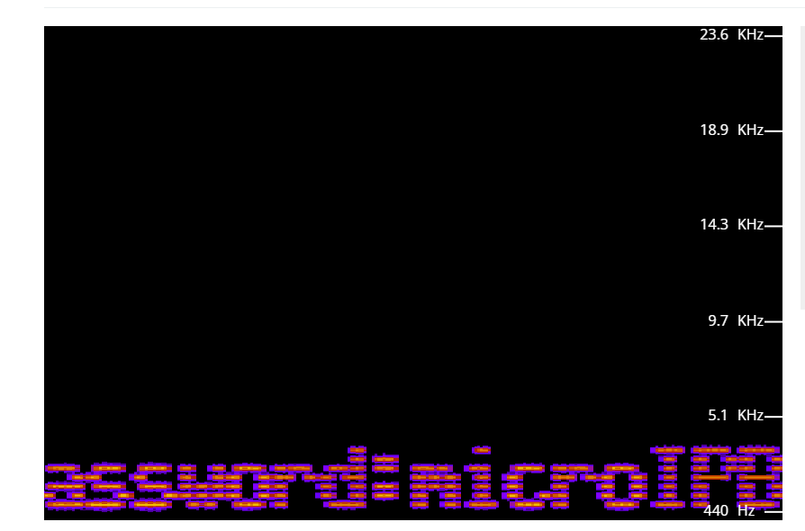

# ITFEST 2025 Warmup - Writeup

sy gabut, jd akhirnya bikin ini aja dah.


## stegano

dikasi file [chall.jpg](chall.jpg)

sesuai nama chall nya ini stegano, jadi coba cek bbrp command (strings, binwalk, file) dan hasilnya gada informasi yang sus. Sekarang coba analisis hex code nya, ditemukan hal berikut:

```
....
00000000: 7269 6666 fcbe 0200 5741 5645 666d 7420  riff....WAVEfmt 
00000010: 1000 0000 0100 0100 44ac 0000 8858 0100  ........D....X..
00000020: 0200 1000 6461 7461 d8be 0200 0000 0000  ....data........
00000030: 0100 0300 0500 0800 0a00 0b00 0b00 0900  ................
00000040: 0600 0200 feff f9ff f6ff f4ff f5ff f7ff  ................
00000050: fbff 0000 0400 0800 0900 0600 0000 f7ff  ................
00000060: ecff e0ff d5ff cdff c8ff c8ff ceff d7ff  ................
00000070: e3ff f0ff fbff 0300 0500 0100 f7ff e9ff  ................
00000080: d8ff c9ff beff b9ff bdff cbff e0ff fdff  ................
00000090: 1b00 3900 5100 6000 6400 5c00 4b00 3200  ..9.Q.`.d.\.K.2.
000000a0: 1800 0200 f6ff f7ff 0800 2900 5700 8d00  ..........).W...
000000b0: c300 f100 0e01 1601 0501 db00 9e00 5500  ..............U.
000000c0: 0c00 ceff a6ff 9dff b7ff f2ff 4600 a400  ............F...
000000d0: fb00 3601 4001 0901 8800 baff aafe 6afd  ..6.@.........j.
000000e0: 17fc d3fa c5f9 10f9 d2f8 21f9 01fa 6dfb  ..........!...m.
000000f0: 4cfd 7bff cb01 0904 0406 8f07 8908 de08  L.{.............
00000100: 8f08 aa07 4d06 a204 da02 2401 acff 91fe  ....M.....$.....
00000110: e7fd b1fd e4fd 67fe 17ff d1ff 6f00 d400  ......g.....o...
00000120: ee00 b500 3100 74ff 99fe c0fd 09fd 8bfc  ....1.t.........
00000130: 5afc 79fc e2fc 83fd 42fe 01ff a3ff 0f00  Z.y.....B.......
...
```

Jadi, setelah di cek hex code file .jpg tsb, ada hex code seperti itu, jika dilihat itu merupakan sebuah hex code untuk file .wav

Lalu, tinggal buat program buat mengekstrak file .wav dari gambar tersebut. Berikut untuk program nya

```py
def extract_wav_from_binary(input_file, output_file):
    with open('chall.jpg', 'rb') as f:
        data = f.read()

    # Cari header WAV: 'RIFF....WAVE'
    riff_index = data.find(b'riff')
    if riff_index == -1:
        print("[!] Header 'RIFF' tidak ditemukan.")
        return

    # Ambil ukuran file dari header
    size_bytes = data[riff_index+4:riff_index+8]
    size = int.from_bytes(size_bytes, byteorder='little')

    # Panjang total file WAV = 8 byte header + size dari header
    wav_length = size + 8

    # Ekstrak WAV
    wav_data = data[riff_index:riff_index + wav_length]

    if len(wav_data) != wav_length:
        print(f"[!] Ukuran data tidak cocok. Ditemukan {len(wav_data)} byte, seharusnya {wav_length} byte.")
        return

    with open(output_file, 'wb') as f:
        f.write(wav_data)

    print(f"[✓] WAV berhasil diekstrak ke: {output_file}")


# Contoh penggunaan:
extract_wav_from_binary('input.jpg', 'output.wav')
```

ok, program ini memisahkan antara chall.jpg dan output.wav, namun file .wav masih belum bisa dibuka karena ada kesalahan pada hex code (riff -> harusnya RIFF), sekarang buat program untuk memperbaiki itu. Berikut untuk programnya:

```py
def repair_wav_header(filepath):
    with open('output.wav', 'rb') as f:
        data = bytearray(f.read())

    # Perbaiki header 'RIFF' dan 'WAVE' jika diperlukan
    if data[0:4] != b'RIFF':
        print("[!] Header bukan 'RIFF'. Memperbaiki...")
        data[0:4] = b'RIFF'
    
    if data[8:12] != b'WAVE':
        print("[!] Format bukan 'WAVE'. Memperbaiki...")
        data[8:12] = b'WAVE'

    with open("output_repaired.wav", 'wb') as f:
        f.write(data)

    print("[✓] File diperbaiki. Coba cek ulang dengan `file output_repaired.wav`.")

repair_wav_header("output_fixed.wav")
```

tinggal jalankan wav tersebut dan lihat spectrumnya.



karena ada informasi berupa password berarti tinggal lakukan steghide gambar tersebut dengan passphrase tersebut.

```
$ steghide extract -sf chall.jpg
Enter passphrase:
wrote extracted data to "flag.txt".
```

## Flag
```
ITFEST25{hmm_apakah_stegano_hanya_ada_di_warmup??}
```


## crypto

dikasi file [chall.txt](chall.txt)

dilihat sekilas isi nya berupa string panjang yang telah diencode pake base64, setelah coba manual ternyata ini tuh berlapis encoding nya.

Yaudah biar ez kita minta gpt buat programnya buat decode string sampe nemu flag nya.

nih program nya
```py
import base64

def recursive_base64_decode(file_path, keyword='ITFEST{'):
    with open("chall.txt", 'r') as f:
        data = f.read().strip()

    iteration = 0
    while True:
        try:
            decoded = base64.b64decode(data).decode('utf-8', errors='ignore')
            iteration += 1
            print(f"[Iterasi {iteration}] => {decoded[:60]}...")  # Cetak sebagian untuk lihat progres

            if keyword in decoded:
                print("\n✅ Ditemukan string target!")
                print(decoded)
                break

            data = decoded  # Lanjut decode hasilnya
        except Exception as e:
            print(f"\n❌ Gagal decode lebih lanjut. Error: {e}")
            break

# Contoh pemakaian
recursive_base64_decode('encoded.txt')
```

tinggal run deh

```
[Iterasi 20] => Vm0wd2QyVkZOVWRXV0doVVYwZG9jRlZ0TVZOWFJsbDNXa2M1VjFac2JETlhh...
[Iterasi 21] => Vm0wd2VFNUdWWGhUV0docFVtMVNXRll3Wkc5V1ZsbDNXa2M1VjFadGVIbFhh...
[Iterasi 22] => Vm0weE5GVXhTWGhpUm1SWFYwZG9WVll3Wkc5V1ZteHlXa1pPVjJKSGVIbFdN...
[Iterasi 23] => Vm0xNFUxSXhiRmRXV0doVVYwZG9WVmxyWkZOV2JHeHlWMjFHVlUxWGVGbGFW...
[Iterasi 24] => Vm14U1IxbFdWWGhUV0doVVlrZFNWbGxyV21GVU1XeFlaVVp3VGsxWFVsbFVW...
[Iterasi 25] => VmxSR1lWVXhTWGhUYkdSVllrWmFUMWxYZUZwTk1XUllUVlZrYkdKSVFsWldN...
[Iterasi 26] => VlRGYVUxSXhTbGRVYkZaT1lXeFpNMWRYTVVkbGJIQlZWMVJDV1UxcmNITlpN...
[Iterasi 27] => VTFaU1IxSldUbFZOYWxZM1dXMUdlbHBVV1RCWU1rcHNZMjVXYzFsWE5XNVlN...
[Iterasi 28] => U1ZSR1JWTlVNalY3WW1GelpUWTBYMkpsY25Wc1lXNW5YM1ZzWVc1blgydGhi...
[Iterasi 29] => SVRGRVNUMjV7YmFzZTY0X2JlcnVsYW5nX3VsYW5nX2thbGl9...
[Iterasi 30] => ITFEST25{base64_berulang_ulang_kali}...
```

## Flag
```
ITFEST25{base64_berulang_ulang_kali}
```